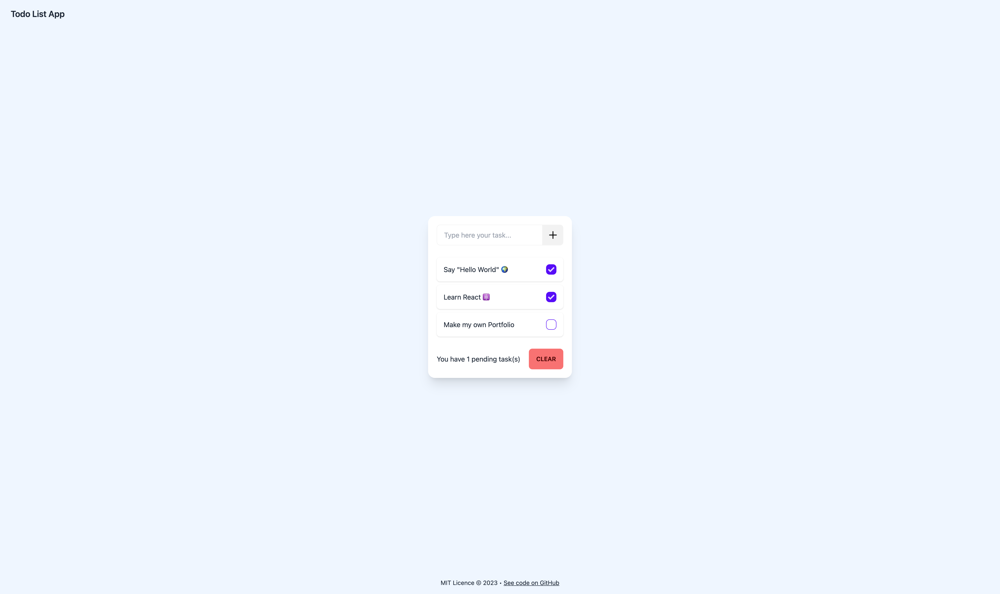

<h1 align="center">Welcome to Todo List 👋</h1>

  
  

> A Todo List app using React, Redux-Toolkit and DaisyUI

### 🏠 [Homepage](https://todo-list-lucasvbr.vercel.app/)

<kbd>
    
</kbd>

## Author

👤 **LucasVbr**

* Github: [@LucasVbr](https://github.com/LucasVbr)
* LinkedIn: [@lucasvbr](https://linkedin.com/in/lucasvbr)

## Show your support

Give a ⭐️ if this project helped you!

## Project Stats

## 📝 License

Copyright © 2023 [LucasVbr](https://github.com/LucasVbr). 
This project is [MIT](./LICENCE) licensed.

[//]: # (_This README was generated with ❤️ by [readme-md-generator]&#40;https://github.com/kefranabg/readme-md-generator&#41;_)
