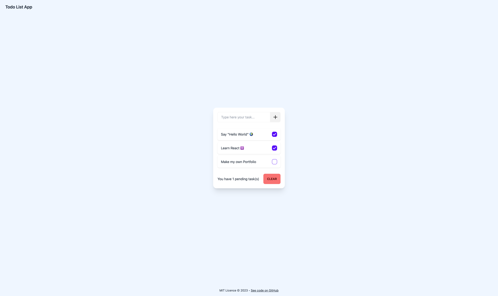

<!-- This README was generated by [readme-md-generator](https://github.com/kefranabg/readme-md-generator) -->

<h1 align="center">Welcome to Todo List 👋</h1>

  
  

> A Todo List app using Angular, TailWind and DaisyUi

### 🏠 [Homepage](https://todo-list-lucasvbr.vercel.app/)

<kbd>
  
</kbd>

## Author

👤 **LucasVbr**

* Github: [@LucasVbr](https://github.com/LucasVbr)
* LinkedIn: [@lucasvbr](https://linkedin.com/in/lucasvbr)

## Show your support

Give a ⭐️ if this project helped you!

## 📊 Project Stats

## 📝 License

Copyright © 2022 [LucasVbr](https://github.com/LucasVbr). 
This project is [MIT](https://choosealicense.com/licenses/mit/) licensed.
